# BayaniServe — System Architecture & Feature Guide

> **Version:** 1.0 · **Stack:** PHP 8+, MySQL (MariaDB), HTML/CSS/JS · **Server:** Apache (XAMPP)

---

## 1. What is BayaniServe?

BayaniServe is a community health supply management system designed for **Kabankalan City's** network of Barangay Health Stations. It digitises the entire medicine lifecycle — from City Health Office (CHO) procurement down to individual resident prescription pick-ups — replacing paper ledgers with a real-time, role-based web application accessible from any browser on the local network.

The system also integrates an AI-powered **resident chatbot** (accessible via the public web or SMS) that allows residents to check medicine availability, reserve supplies, and receive official health announcements — without visiting the station in person.

---

## 2. System Roles & Access Levels

| Role | Who | What they control |
|---|---|---|
| **Super Admin** (City Health Officer) | CHO staff at City Hall | City-wide inventory view, requisition approvals, emergency mode, user account management, announcements to all barangays |
| **Barangay Admin** (Midwife/BHW) | Health worker at each barangay station | Local inventory, reservations, residents, requisition requests, walk-in dispensing, announcements to own barangay |
| **Resident** (Public) | Any community member | Chatbot access: medicine queries, reservation requests, health announcements (no login required) |

---

## 3. Complete Feature Breakdown

### 3.1 Dashboard
**File:** `admin/dashboard.php`

The landing page after login. Displays a real-time snapshot of the station (or city, for CHO):

- **KPI Metric Cards** — total stock items, pending reservations, active low-stock alerts, and pending requisitions, each with live counts drawn directly from the database.
- **Recent Reservations Feed** — the last 5 reservation requests from residents (chatbot or SMS), with name, medicine, date, and status badge.
- **Recent Requisitions Feed** — the last 5 supply requests between the barangay and CHO, with approval status indicators.
- **Activity Timeline** — a chronological log of the 8 most recent system events (stock updates, approvals, deliveries, etc.) shown as an icon-led timeline.

---

### 3.2 Inventory Management
**File:** `admin/inventory.php`

Manages the physical stock of medicines at each barangay station.

**Barangay Admin can:**
- **Add / Update Single Item** — enter a medicine name, category, and quantity. If the medicine already exists in their station's stock, the quantity is added to the existing record; otherwise a new entry is created.
- **Bulk Import via CSV** — upload a 3-column CSV (`medicine_name`, `category`, `quantity`) to import multiple medicines at once. Useful for initial setup or large restocking events.
- **View Station Inventory Table** — a sortable table of every medicine at their assigned station, showing name, category, quantity, stock status badge (In Stock / Low Stock / Out of Stock), and last-updated date.
- **Expiry Alert Banner** — if any batch is expiring within 30 days, a warning panel lists those items above the inventory table.

**Super Admin can:**
- View the inventory of **all** barangay stations in a combined table (read-only).
- The read-only notice reminds CHO that stock changes flow only through the Requisition → Delivery confirmation process, not direct edits.
- **Bulk Import via CSV** — the CHO version accepts a 4-column CSV (`medicine_name`, `category`, `quantity`, `station`) to distribute stock across multiple barangays at once.

**Stock Status Logic (automated):**
- `in_stock` — quantity > 10
- `low_stock` — quantity between 1 and 10
- `out_of_stock` — quantity = 0

---

### 3.3 Supply Requisitions
**File:** `admin/requisitions.php`

The formal supply request pipeline between barangay stations and the City Health Office.

**Barangay Admin workflow:**
1. **Stock Warning Banner** — if any medicine at their station is low/out, an alert lists them automatically above the form.
2. **Submit Requisition** — fill out medicine (from catalogue or custom name), quantity needed, and a written justification/reason. Submits to CHO for review.
3. **Track Requisitions** — view all submitted requests with current status (Pending / Approved / Partial / Rejected / Delivered).
4. **Confirm Delivery** — once CHO approves, an action button appears. Clicking it marks the requisition as Delivered and automatically adds the approved quantity to the station's live inventory.

**Super Admin (CHO) workflow:**
1. Views **all** requisitions from every barangay station.
2. For each pending request, selects a decision:
   - **Approve Full** — approve the full requested quantity.
   - **Approve Partial** — approve a smaller quantity (enter custom amount).
   - **Reject** — reject with a written reason shown back to the Barangay Admin.
3. Decision is logged and the barangay admin sees the updated status immediately.

**Flow Steps Indicator** — a visual 4-step progress bar at the top of the page guides the barangay admin through the process:
`Check inventory → Submit requisition → City Health decides → Confirm delivery`

---

### 3.4 Reservations
**File:** `admin/reservations.php`

Manages medicine reservation requests submitted by residents through the public-facing chatbot or SMS gateway. Barangay admins do not manually create these; they only review and act on incoming requests.

Each row shows: resident name, mobile number, medicine name, source channel (Chat or SMS), requested pickup date, and current status.

**Actions:**
- **Approve** — confirms the reservation; the resident is notified (SMS gateway sends an auto-reply if the source was SMS).
- **Decline** — rejects the request with a notification.
- Status progresses through: `Pending → Approved → Completed` (or `Declined`).

---

### 3.5 Resident Records
**File:** `admin/residents.php`

A contact management panel for residents registered under each barangay station. Used primarily to maintain the SMS subscriber list for announcements.

**Features:**
- **CSV Import** — upload a 3-column CSV (`full_name`, `mobile_number`, `barangay`) to bulk-register residents.
- **Download Template** — download a pre-formatted CSV template.
- **Search / Filter** — live search by name or mobile number.
- **Edit Resident** — inline modal to update name or mobile number.
- **SMS Status Badge** — shows "Active" if a mobile number is on file, otherwise flags the record as incomplete.

---

### 3.6 Walk-In Dispensing
**File:** `admin/dispense.php`

A direct dispensing log for walk-in patients — residents who come to the health station in person, outside of the online reservation system.

**Features:**
- **Resident Search** — type-ahead input searches the registered resident list. A quick **Add New** button opens a modal to register a new resident on the spot without leaving the page.
- **Medicine Search** — type-ahead input across all medicines in the station's inventory.
- **Quantity Entry** — enter the units dispensed.
- **FIFO Deduction** — when batch/expiry records are present, BayaniServe automatically deducts from the batch with the earliest expiration date first (First In, First Out).
- **Recent Transactions Feed** — a sidebar showing the last 10 walk-in dispensing events for quick reference.

---

### 3.7 Announcements
**File:** `admin/announcements.php`

A broadcast messaging system for official health notifications.

**Barangay Admin:**
- Posts announcements visible to residents of their own barangay only (station is locked — cannot broadcast city-wide).
- Announcements are queued for SMS delivery to all registered residents in their barangay.

**Super Admin (CHO):**
- Can target **All Barangays** or a specific barangay station from a dropdown.
- City-wide announcements reach all registered resident phone numbers in the system.
- Shows a feed of all announcements with metadata (posted by, date/time, target station badge).

---

### 3.8 Emergency Mode
**File:** `admin/emergency.php`

A disaster-response override mode that unlocks accelerated distribution protocols during calamities (typhoons, disease outbreaks, etc.).

**Super Admin exclusive — Activation:**
- Set a custom emergency label (e.g., "Typhoon Response — Kabankalan").
- Set a **per-household limit** (e.g., max 5 units per medicine per household).
- Toggle **Bypass Approval** — when enabled, emergency requisitions from barangays are auto-approved without CHO review.
- System-wide banner displays "ACTIVE" status in red across all admin sessions.

**Deactivation:**
- CHO clicks "Deactivate Emergency" to return all operations to normal mode.

**Barangay Admin — During Active Emergency:**
- A **Log Household Distribution** form appears, enabling direct logging of medicine given to each household (name, address, mobile, quantity, medicine, notes).
- **Distribution Summary Table** — aggregated totals per medicine per station for real-time situational awareness.
- **Distribution Log** — timestamped per-household record of everything distributed during the emergency event.

---

### 3.9 Analytics & Forecasting
**File:** `admin/analytics.php`

Data intelligence layer for decision-making.

**Barangay Admin view:**
- **Average Monthly Demand** — computed from historical monthly inventory snapshots.
- **Days of Stock Remaining (DoSR)** — divides current closing stock by average daily demand. Colour-coded: green (adequate), amber (order soon), red (critical — reorder now).
- **Demand Trend & 3-Month Forecast Chart** — Chart.js line chart showing actual monthly distribution over selected months, extrapolated forward using linear regression.
- **Reorder Alert Banner** — if DoSR ≤ 30 days, a prominent alert with exact day count prompts the admin.
- **Generate Requisition Button** — pre-fills a requisition based on the system's calculated suggested quantity and submits it to CHO in one click.
- **Station Distribution vs Received Chart** — compares units distributed to units received per station over the last 6 months.
- **Seasonal Demand Chart** — shows demand patterns by month of year.

**Super Admin (Executive) view:**
- **KPI Cards** — total units distributed all-time, pending requisitions count, approved/rejected requisition totals, stations with stockout risk, registered station count.
- **All-Station Distribution Chart** — bar chart comparing distribution volume across all barangays.
- **Community Vulnerability Mapping** — lists stations currently experiencing stockout by medicine, used for prioritising CHO supply allocation.
- **Admin Performance Log** — table and chart of requisition volume per station (used as a workload and activity proxy).
- **Top Requested Medicines** — bar chart of most frequently requested medicines across the chatbot and SMS channels.

**Filter Controls:**
- Select medicine, select station, and choose a time window (3–24 months) to drill into specific data combinations.

---

### 3.10 Monthly Inventory Report
**File:** `admin/monthly_report.php`

Provides a snapshot history of inventory levels, month by month.

- Snapshots are **auto-generated** on every page load — the current calendar month's snapshot is refreshed in real-time.
- Once the calendar month turns, that snapshot freezes permanently, preserving historical data for trend analysis.
- Barangay Admins see their own station's history only; the Super Admin sees all stations.
- Data feeds directly into the Analytics & Forecasting module.

---

### 3.11 Activity Log
**File:** `admin/activity_log.php`

A complete audit trail of every significant system action.

- Logged events include: stock additions, CSV imports, reservation approvals/declines, requisition submissions and decisions, delivery confirmations, emergency activations, account creations, and announcements.
- Each log entry shows: timestamp, event type icon, description, and the admin who performed the action.
- Super Admin sees all activity across all stations; Barangay Admin sees only their own station's log.

---

### 3.12 User Management
**File:** `admin/user_management.php` · **Super Admin only**

- **Create Barangay Admin accounts** — set username, full name, password, and assign to a specific barangay station.
- **View all admin accounts** — table of every account with role, station, and active/inactive status.
- **Activate / Deactivate** — toggle account access without deleting the record.
- **Reset Password** — inline password field per row allows CHO to reset any barangay admin's credentials directly.

---

### 3.13 Resident Chatbot
**Files:** `resident/chatbot.php`, `resident/chat_api.php`, `resident/stock_api.php`

A public-facing AI-powered chat interface (accessible at the resident-facing URL, no login required) powered by an Ollama local LLM (or fallback to a rule-based parser).

**Resident capabilities:**
- **Medicine Availability Query** — ask if a specific medicine is in stock at their barangay's health station. The system queries live inventory and responds with stock level.
- **Reserve Medicine** — initiate a reservation request through the chat; logged in the reservations table for barangay admin review.
- **Health Announcements** — ask for the latest announcements relevant to their barangay.
- **General Health Q&A** — the LLM handles general health questions with context about the local health system.

---

### 3.14 SMS Gateway Integration
**Files:** `sms/` directory

Connects BayaniServe to a physical GSM modem or SMS API (e.g., Semaphore, Twilio, or Gammu).

- **Inbound SMS parsing** (`sms/sms_parser.php`) — processes incoming SMS messages from residents, extracts intent (medicine query, reservation request) and routes them as reservation entries.
- **Outbound SMS** (`sms/send_sms.php`, `sms/outbox_api.php`) — queues and sends SMS replies, reservation confirmations, and announcement blasts to registered residents.
- **Polling** (`sms/poll_outbox.php`) — a background polling script for Gammu-based GSM modems; can be run via cron job.
- **Receive endpoints** (`sms/receive.php`, `sms/receive_api.php`) — HTTP endpoints that receive inbound SMS delivery callbacks from cloud SMS APIs.

---

## 4. User Workflows

### 4.1 City Health Officer (Super Admin)

```
Login
  │
  ├─ Dashboard → Review KPIs and city-wide activity
  │
  ├─ Requisitions → Review pending supply requests from barangays
  │       │
  │       └─ Approve Full / Approve Partial / Reject → Barangay notified
  │
  ├─ Inventory → View all-station stock (read-only), bulk CSV import
  │
  ├─ Analytics → Monitor demand trends, vulnerability mapping, admin performance
  │
  ├─ Emergency Mode → Activate if disaster; set limits; deactivate when resolved
  │
  ├─ Announcements → Broadcast health notices to all or specific barangays
  │
  ├─ User Management → Create/deactivate/reset barangay admin accounts
  │
  └─ Logout
```

---

### 4.2 Barangay Admin (Midwife / BHW)

```
Login
  │
  ├─ Dashboard → Check local KPIs, recent reservations, recent requisitions
  │
  ├─ Inventory → Add/update medicine stock, bulk CSV import, view station inventory
  │
  ├─ Reservations → Review pending reservations from chatbot/SMS
  │       │
  │       └─ Approve / Decline → SMS auto-reply sent to resident (if via SMS)
  │
  ├─ Walk-In Dispensing → Log direct dispensing to walk-in patients; FIFO deduction
  │
  ├─ Requisitions → Submit supply request to CHO when stock is low
  │       │
  │       └─ Once approved → Confirm Delivery → stock auto-added to inventory
  │
  ├─ Residents → Import resident contacts via CSV, manage subscriber list
  │
  ├─ Announcements → Post barangay-level health announcements (SMS-broadcast)
  │
  ├─ Analytics → View DoSR, demand forecast, generate requisition from forecast
  │
  ├─ Monthly Reports → Review historical inventory snapshots
  │
  ├─ Activity Log → Audit trail of all station actions
  │
  └─ Logout
```

---

### 4.3 Resident (Public / No Login)

```
Open chatbot URL (or send SMS to station number)
  │
  ├─ Ask about medicine availability
  │       └─ System checks live inventory → responds with stock status
  │
  ├─ Request a reservation
  │       └─ Reservation logged → Barangay Admin reviews and approves/declines
  │               └─ Resident notified via SMS reply
  │
  └─ Ask about announcements
          └─ Latest announcements for their barangay returned
```

---

## 5. Conceptual Architecture Diagram

```mermaid
flowchart TD
    subgraph PUBLIC["Public Layer"]
        RES["Resident\n(Browser / SMS)"]
    end

    subgraph CHATBOT["Chatbot & SMS Gateway"]
        CB["chatbot.php\n(AI Chat Interface)"]
        SMSPARSE["sms_parser.php\n(Inbound SMS)"]
        SMSSEND["send_sms.php\n(Outbound SMS)"]
        OLLAMA["Local LLM\n(Ollama / Rule-based)"]
    end

    subgraph ADMIN["Admin Portal  (admin/)"]
        direction TB
        LOGIN["login.php"]
        DASH["dashboard.php"]

        subgraph CHO["City Health Office — Super Admin"]
            REQ_APP["requisitions.php\n(Approve/Reject)"]
            INV_VIEW["inventory.php\n(City-wide view)"]
            EMERGENCY["emergency.php\n(Emergency Mode)"]
            USERMGMT["user_management.php"]
            ANN_CHO["announcements.php\n(All Barangays)"]
            ANALYTICS_CHO["analytics.php\n(Executive View)"]
        end

        subgraph BRGY["Barangay Station — Barangay Admin"]
            INV_LOCAL["inventory.php\n(Local Stock)"]
            RESERV["reservations.php"]
            DISPENSE["dispense.php\n(Walk-in)"]
            REQ_SUB["requisitions.php\n(Submit Request)"]
            RESIDENTS["residents.php"]
            ANN_BRGY["announcements.php\n(Own Barangay)"]
            ANALYTICS_BRGY["analytics.php\n(Operational View)"]
            MONTHLY["monthly_report.php"]
            ACTLOG["activity_log.php"]
        end
    end

    subgraph DB["Database  (MySQL)"]
        direction TB
        ADMINS[("admins")]
        STATIONS[("health_stations")]
        INVENTORY[("inventory")]
        MEDICINES[("medicines")]
        RESERVATIONS_T[("reservations")]
        REQUISITIONS_T[("requisitions")]
        RESIDENTS_T[("residents")]
        ANNOUNCEMENTS_T[("announcements")]
        ACTIVITY[("activity_log")]
        EMERGENCY_T[("emergency_mode")]
        SNAPSHOTS[("monthly_inventory_snapshots")]
        DISTRIBUTIONS[("emergency_distributions")]
        SMS_QUEUE[("sms_outbox")]
        MED_REQUESTS[("medicine_requests")]
    end

    %% Public → Chatbot/SMS
    RES -- "Browser Chat" --> CB
    RES -- "SMS Message" --> SMSPARSE

    %% Chatbot internals
    CB --> OLLAMA
    CB --> RESERVATIONS_T
    CB --> INVENTORY
    SMSPARSE --> RESERVATIONS_T
    SMSPARSE --> INVENTORY
    SMSSEND --> RES

    %% Admin → DB
    LOGIN --> ADMINS
    DASH --> INVENTORY & RESERVATIONS_T & REQUISITIONS_T & ACTIVITY

    %% CHO Admin
    REQ_APP --> REQUISITIONS_T
    INV_VIEW --> INVENTORY
    EMERGENCY --> EMERGENCY_T & DISTRIBUTIONS
    USERMGMT --> ADMINS
    ANN_CHO --> ANNOUNCEMENTS_T & SMS_QUEUE
    ANALYTICS_CHO --> SNAPSHOTS & REQUISITIONS_T & INVENTORY

    %% Barangay Admin
    INV_LOCAL --> INVENTORY
    RESERV --> RESERVATIONS_T
    DISPENSE --> INVENTORY & RESIDENTS_T
    REQ_SUB --> REQUISITIONS_T
    RESIDENTS --> RESIDENTS_T
    ANN_BRGY --> ANNOUNCEMENTS_T & SMS_QUEUE
    ANALYTICS_BRGY --> SNAPSHOTS & MED_REQUESTS
    MONTHLY --> SNAPSHOTS
    ACTLOG --> ACTIVITY

    %% SMS Queue → Send
    SMS_QUEUE --> SMSSEND

    %% Styles
    classDef public fill:#dbeafe,stroke:#93c5fd,color:#1e3a8a
    classDef chatbot fill:#ede9fe,stroke:#a78bfa,color:#4c1d95
    classDef cho fill:#fef3c7,stroke:#fbbf24,color:#78350f
    classDef brgy fill:#d1fae5,stroke:#6ee7b7,color:#064e3b
    classDef db fill:#f3f4f6,stroke:#9ca3af,color:#374151

    class RES public
    class CB,SMSPARSE,SMSSEND,OLLAMA chatbot
    class REQ_APP,INV_VIEW,EMERGENCY,USERMGMT,ANN_CHO,ANALYTICS_CHO cho
    class INV_LOCAL,RESERV,DISPENSE,REQ_SUB,RESIDENTS,ANN_BRGY,ANALYTICS_BRGY,MONTHLY,ACTLOG brgy
    class ADMINS,STATIONS,INVENTORY,MEDICINES,RESERVATIONS_T,REQUISITIONS_T,RESIDENTS_T,ANNOUNCEMENTS_T,ACTIVITY,EMERGENCY_T,SNAPSHOTS,DISTRIBUTIONS,SMS_QUEUE,MED_REQUESTS db
```



---

## 6. Key Data Flows

| Flow | Steps |
|---|---|
| **Resident reserves medicine** | Resident chats/SMS → chatbot/sms_parser creates reservation record → Barangay Admin approves in reservations.php → SMS auto-reply sent to resident |
| **Station runs out of stock** | inventory.php sets status to `out_of_stock` → badge visible on inventory page + sidebar badge → Admin submits requisition → CHO approves → Barangay Admin confirms delivery → stock auto-added |
| **CHO broadcasts announcement** | announcements.php posts record → system queries all residents in target station(s) → queues individual SMS per resident → send_sms.php delivers |
| **Monthly snapshot cycle** | monthly_report.php page load triggers snapshot upsert for current month → previous months freeze → analytics.php reads snapshots for trend charts and DoSR |
| **Emergency declared** | Super Admin activates emergency_mode → all sessions see ACTIVE banner → barangay admins see distribution form → each distribution logged and deducts from inventory → CHO monitors live summary |

---

## 7. Technology Stack

| Layer | Technology |
|---|---|
| **Web Server** | Apache 2.4 (XAMPP) |
| **Backend Language** | PHP 8+ |
| **Database** | MySQL / MariaDB |
| **Frontend** | Vanilla HTML, CSS, JavaScript |
| **Charts** | Chart.js (CDN) |
| **Icons** | Bootstrap Icons 1.11 (CDN) |
| **AI / LLM** | Ollama (local) — configurable model (Llama 3, Mistral, etc.) |
| **SMS** | Gammu (GSM modem) or cloud API (Semaphore / Twilio) |
| **Auth** | PHP session-based, `password_hash` / `password_verify` |

---

*Generated: June 2026 · BayaniServe v1.0*
